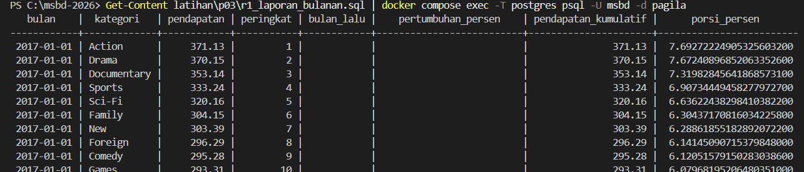

# Laporan Latihan Kelompok 2 Pertemuan 3

## Anggota Kelompok

| Nama | NIM | Kontribusi |
|------|-----|------------|
| Agnes Natalia Br Siregar| 251402108 | Q1-Q5 (Subquery), Refleksi A, setup q00 |
| Abdullah Zufar Aulia Nasution | 251402111 | Q6-Q9 (CTE & Recursive CTE), Refleksi B |
| Fakhry Adrian Daulay | 251402053 | Q10-Q13 (Window Function), Refleksi C |
| Rasyd Arija Azron Ritonga | 251402020 | Q14–Q15 (Window Function), Q16–Q17 (Agregasi Lanjutan), Refleksi C-D |
| Dwi Charima Husni | 251402088 | Q16-Q20 (Agregasi & JSONB), R1, Refleksi E |

## Refleksi A - Subquery

1. Pada Q4, apa tepatnya yang membuat NOT IN berbahaya, dan bagaimana memeriksa apakah sebuah kolom rawan terhadap masalah itu?
> Penyebab bahaya NOT IN adalah mengevaluasi kondisi keanggotaan menggunakan logika tiga nilai (Three-Valued Logic) SQL (TRUE, FALSE, UNKNOWN). Jika subquery mengembalikan bahkan satu saja nilai NULL, seluruh ekspresi WHERE col NOT IN akan mengevaluasi baris menjadi UNKNOWN (karena tidak bisa memastikan apakah sebuah nilai yang tidak diketahui cocok atau tidak). Akibatnya, query langsung mengembalikan 0 baris (kosong) tanpa error sama sekali.

Cara memeriksa apakah kolom rawan: 
Cek apakah kolom yang dijadikan target di subquery memiliki potensi atau batasan NULL (NOT NULL). Kamu bisa jalankan query pengecekan sederhana seperti:

SQL
SELECT COUNT(*) FROM nama_tabel WHERE nama_kolom IS NULL;
Jika hasilnya > 0, kolom tersebut sangat rawan membuat NOT IN gagal total. Sebagai pencegahan yang aman, lebih baik beralih menggunakan NOT EXISTS atau menambahkan filter WHERE nama_kolom IS NOT NULL di dalam subquery.

2. Pada Q5, berapa kali subquery dievaluasi secara konseptual, dan mengapa “sekali per baris luar” belum tentu sama dengan yang benar-benar dikerjakan mesin?
> Secara konseptual, subquery berkorelasi dievaluasi sekali buat tiap baris di tabel luar. Jadi kalau tabel luarnya ada 1.000 baris,  subquery-nya dijalankan satu-satu sebanyak 1.000 kali.

Tapi, Pada mesin database, hal itu belum tentu dikerjakan seperti itu. Query Optimizer modern (PostgreSQL) mesin database sering melakukan subquery unnesting (mengubah subquerynya jadi operasi JOIN) atau caching hasil. Jadi, eksekusi aslinya bisa jauh lebih optimize dan nggak bener-bener ngeloop dari nol terus-terusan setiap baris.

## Refleksi B - CTE dan Recursive CTE

1. Pada Q7, mengapa recursive term hanya melihat baris yang baru dihasilkan pada iterasi sebelumnya, dan apa akibatnya jika ia melihat seluruh hasil?
> Recursive CTE bekerja dengan "working table": tiap putaran hanya memproses baris baru dari putaran sebelumnya, bukan seluruh hasil yang terkumpul. Kalau ia memproses seluruh hasil, baris lama ikut diulang terus tiap putaran, sehingga jumlah baris membengkak (bisa eksponensial) dan pada data yang bersiklus query tidak akan pernah berhenti.

2. Kapan mengganti UNION ALL dengan UNION dapat menghentikan siklus, dan mengapa itu tetap bukan solusi yang baik?
> UNION hanya menghentikan siklus kalau baris yang berulang persis sama di semua kolom. Pada Q7, kolom level dan jalur selalu berubah tiap putaran, jadi baris tidak pernah benar-benar identik dan siklus tetap jalan terus — UNION tidak bisa diandalkan. Selain itu UNION lebih mahal karena harus membandingkan seluruh kolom setiap baris untuk deteksi duplikat, padahal solusi seperti array jalur (NOT (id = ANY(jalur_id))) langsung menyasar akar masalah (id yang berulang) dengan biaya lebih murah dan maksud yang lebih jelas.

## Refleksi C - Window Function
1. Pada Q14, berapa tanggal yang berbeda, dan sifat data apa pada tabel payment yang menyebabkan perbedaan?
> Pada Q14, jumlah tanggal kalender yang berbeda lebih sedikit daripada jumlah baris pada tabel payment. Penyebabnya adalah satu tanggal dapat memiliki banyak transaksi pembayaran. Selain itu, kolom payment_date menyimpan informasi tanggal dan waktu, sehingga beberapa transaksi yang terjadi pada tanggal kalender yang sama tetap memiliki nilai payment_date yang berbeda.

2. Jika Q13 menjadi laporan resmi keuangan, versi mana yang benar dan mengapa kesalahan frame sulit ditemukan melalui pengujian biasa?
> Pada Q13, versi query yang benar untuk laporan keuangan adalah query yang terlebih dahulu mengubah data transaksi pada tabel payment menjadi omzet per hari, kemudian menerapkan window function pada hasil agregasi harian tersebut. Untuk omzet kumulatif digunakan frame ROWS BETWEEN UNBOUNDED PRECEDING AND CURRENT ROW, sedangkan untuk rata-rata bergerak tujuh hari digunakan ROWS BETWEEN 6 PRECEDING AND CURRENT ROW.

Kesalahan frame sulit ditemukan karena query tetap berjalan tanpa error dan menghasilkan angka yang terlihat wajar, tetapi ROWS menghitung jumlah baris, bukan jumlah hari. Jika satu hari memiliki banyak transaksi, tujuh baris belum tentu berarti tujuh hari.

3. Pada Q15, apa yang terjadi pada total belanja jika ORDER BY ditambahkan ke dalam OVER tanpa menuliskan frame?
> Jika frame dihilangkan sementara ORDER BY tetap digunakan, PostgreSQL menggunakan frame default sampai CURRENT ROW, sehingga SUM() berubah menjadi total kumulatif pelanggan.

##  Reflektif D - Agregasi dan Operasi Himpunan

1. Pada Q16, tanpa GROUPING(), bagaimana pembaca membedakan subtotal dari baris data yang kolomnya memang kosong?
> Pada Q16, tanpa GROUPING(), pembaca sulit membedakan apakah nilai NULL pada kolom hasil grouping merupakan subtotal atau memang nilai kolom data yang kosong (NULL). GROUPING() digunakan untuk menandai apakah NULL tersebut berasal dari baris subtotal/rollup atau dari data asli.

2. Pada Q17, mengapa versi FILTER dan CASE WHEN dapat memberi rata-rata berbeda walaupun jumlah baris sama?
> Pada Q17, FILTER dan CASE WHEN dapat menghasilkan rata-rata berbeda karena cara menghitungnya berbeda. FILTER menghitung agregat hanya pada baris yang memenuhi kondisi, sedangkan CASE WHEN dapat menghasilkan NULL pada baris yang tidak memenuhi kondisi dan kemudian AVG() hanya menghitung nilai yang bukan NULL. Jika ekspresi atau kondisi yang digunakan tidak benar-benar ekuivalen, jumlah baris yang masuk ke perhitungan rata-rata bisa berbeda, sehingga hasil AVG() juga berbeda.

## Refleksi E - JSONB
1. Dari nomor transaksi, status, jumlah, dan identitas pelanggan di dalam payload, mana yang sebaiknya dipromosikan menjadi kolom relasional dengan constraint dan mana yang tepat tetap berada di JSON? Berikan alasan untuk setiap pilihan.
> Data di dalam payload dapat dibagi berdasarkan seberapa sering data tersebut digunakan dan seberapa penting aturan yang perlu diterapkan.
- Nomor transaksi → lebih baik dijadikan kolom relasional karena setiap transaksi membutuhkan identitas yang jelas dan konsisten. Kolom ini juga dapat diberi constraint, seperti UNIQUE, agar tidak ada nomor transaksi yang sama.
- Status → lebih baik menjadi kolom relasional karena biasanya sering digunakan untuk pencarian, filtering, dan menentukan kondisi suatu transaksi. Nilainya juga dapat dibatasi agar hanya menggunakan status yang valid dan konsisten.
- Jumlah → lebih baik menjadi kolom relasional dengan tipe data numerik. Dengan begitu, data jumlah dapat langsung digunakan untuk berbagai perhitungan, seperti total pendapatan, rata-rata, atau laporan transaksi, tanpa perlu melakukan konversi dari teks terlebih dahulu.
- Identitas pelanggan → lebih cocok dijadikan data relasional apabila data pelanggan sering digunakan untuk pencarian atau dihubungkan dengan transaksi lain. Namun, informasi tambahan pelanggan yang sifatnya lebih fleksibel dan tidak selalu sama pada setiap transaksi masih dapat tetap disimpan dalam JSON.

Jadi, data yang sering digunakan untuk pencarian, perhitungan, dan memiliki aturan tertentu lebih baik dipromosikan menjadi kolom relasional. Sementara itu, JSON tetap berguna untuk menyimpan informasi tambahan yang lebih fleksibel dan memungkinkan strukturnya berbeda-beda.

## Temuan Q14
Berdasarkan hasil perbandingan, terdapat 34 tanggal yang memiliki hasil berbeda antara Q13 dan Q14. Perbedaan terlihat pada kolom rerata, sedangkan nilai kumulatif pada kedua query tetap sama. Hal ini terjadi karena Q13 menggunakan frame ROWS secara eksplisit untuk membatasi perhitungan sesuai frame yang ditentukan, sedangkan Q14 tidak menggunakan klausa frame sehingga menggunakan perilaku default RANGE. Akibatnya, cara PostgreSQL menentukan baris yang ikut dalam perhitungan rata-rata menjadi berbeda, sehingga seluruh 34 tanggal pada hasil perbandingan menunjukkan nilai rerata yang berbeda.

## Hasil R1

 ## Tautan Merge Request

 https://github.com/dwicharima/K2_MSBD