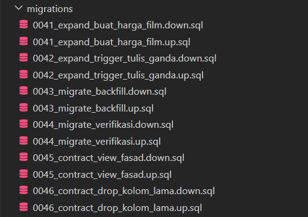

# Laporan Latihan Kelompok Pertemuan 4

| Nama | NIM | Kontribusi |
|------|-----|------------|
| Agnes Natalia Siregar | 251402108 | Q1-Q4, refleksi A |
| Fakhry Adrian Daulay | 251402053 | Q5-Q8, refleksi B | 
| Rasyd Arija A. Ritonga |251402020 | Q9-Q15, refleksi C | 
| Dwi Charima Husni | 251402088 | Q16-Q18, refleksi D |
| Abdullah Zufar Aulia | 251402111 | Q19-Q21, reflektif E |

---

### Q1

**Perintah :**
```
CREATE SCHEMA IF NOT EXISTS lab4;
SET search_path = lab4, public;

DROP TABLE IF EXISTS lab4.jejak_akses CASCADE;
DROP TABLE IF EXISTS lab4.film CASCADE;

CREATE TABLE lab4.film (
    film_id serial PRIMARY KEY,
    title text NOT NULL,
    description text,
    release_year integer,
    language_id smallint,
    rental_duration smallint DEFAULT 3,
    rental_rate numeric(4,2) NOT NULL DEFAULT 4.99,
    length smallint,
    replacement_cost numeric(5,2),
    rating text DEFAULT 'G',
    last_update timestamp DEFAULT now()
);

INSERT INTO lab4.film (title, rental_rate, rating) VALUES
('Film A', 0.99, 'G'),
('Film B', 4.99, 'R'),
('Film C', 0.50, 'PG');

CREATE TABLE lab4.jejak_akses (
    akses_id bigserial PRIMARY KEY,
    film_id integer NOT NULL,
    waktu timestamptz NOT NULL,
    kanal text NOT NULL
);

INSERT INTO lab4.jejak_akses (film_id, waktu, kanal)
SELECT (random() * 999)::int + 1,
       now() - (random() * 365) * interval '1 day',
       (ARRAY['web','android','ios','kiosk'])[(random() * 3)::int + 1]
FROM generate_series(1, 500000);

ANALYZE lab4.jejak_akses;
SELECT count(*) FROM lab4.jejak_akses;
```

**Keluaran :**
```
AGNES@LAPTOP-1T3ANVB7 MINGW64 ~/msbd-2026 (latihan/p04-sql2)
$ docker exec -i msbd-pg psql -U msbd -d latihan < latihan/p04/q01_view_film_murah.sql
CREATE VIEW
```

**Alasan :**
```
Perintah ini berfungsi untuk membuat view fasad (tabel virtual) bernama lab4.film_murah yang menyaring data film dengan harga sewa rental_rate <= 0.99. Tanpa adanya CHECK OPTION, view ini bertindak sebagai jendela filter yang memperbolehkan operasi tulis ke tabel dasar tanpa memvalidasi apakah data baru tersebut benar-benar memenuhi kriteria WHERE.
```
---

### Q2
**Perintah :**
```
-- Diminta: menyisipkan satu film melalui view lab4.film_murah dengan rental_rate = 4.99, menghitung jumlah baris dengan judul yang sama di view dan tabel dasar, lalu menjelaskan selisihnya.
-- Dipilih: Melakukan INSERT melalui view tanpa check option dilanjutkan dengan query UNION ALL untuk menghitung baris di view dan tabel dasar agar silent filtering terlihat jelas.
-- Alternatif: Melakukan INSERT langsung ke tabel dasar; tidak dipilih karena tidak menguji perilaku mutasi data melalui view fasad.

INSERT INTO lab4.film_murah (title, rental_rate, rating)
VALUES ('Film Gaib Q2', 4.99, 'PG');

SELECT 'Di View' AS lokasi, count(*) FROM lab4.film_murah WHERE title = 'Film Gaib Q2'
UNION ALL
SELECT 'Di Tabel Dasar' AS lokasi, count(*) FROM lab4.film WHERE title = 'Film Gaib Q2';
```

**Keluaran :**
```
AGNES@LAPTOP-1T3ANVB7 MINGW64 ~/msbd-2026 (latihan/p04-sql2)
$ docker exec -i msbd-pg psql -U msbd -d latihan < latihan/p04/q02_baris_menghilang.sql
INSERT 0 1
     lokasi     | count 
----------------+-------
 Di View        |     0
 Di Tabel Dasar |     2
(2 rows)
```

**Alasan :**
```
Terjadi silent filtering. Baris data dengan harga 4.99 berhasil masuk dan tersimpan secara fisik di dalam tabel dasar (lab4.film), namun langsung disaring keluar oleh kondisi WHERE pada view. Akibatnya, saat dicek melalui view, jumlah barisnya 0, sementara di tabel dasar data tersebut benar-benar ada. Hal ini berbahaya karena operasi insert tampak berhasil bagi aplikasi, padahal datanya tersembunyi dari view.
```

---

### Q3
**Perintah :**
```
-- Diminta: membuat ulang view lab4.film_murah dengan WITH CASCADED CHECK OPTION, mengulangi penyisipan data dengan rental_rate = 4.99, dan menyalin pesan galat secara utuh.
-- Dipilih: Menggunakan CREATE OR REPLACE VIEW ditambah klausa WITH CASCADED CHECK OPTION agar setiap data yang dimasukkan wajib lolos dari filter WHERE view.
-- Alternatif: Menggunakan WITH LOCAL CHECK OPTION; tidak dipilih karena untuk view tunggal tanpa view bertingkat, cascaded lebih aman untuk memastikan tidak ada celah aturan filter.

CREATE OR REPLACE VIEW lab4.film_murah AS
SELECT film_id, title, rental_rate, rating
FROM lab4.film
WHERE rental_rate <= 0.99
WITH CASCADED CHECK OPTION;

INSERT INTO lab4.film_murah (title, rental_rate, rating)
VALUES ('Film Ditolak Q3', 4.99, 'PG');
```

**Keluaran :**
```
AGNES@LAPTOP-1T3ANVB7 MINGW64 ~/msbd-2026 (latihan/p04-sql2)
$ docker exec -i msbd-pg psql -U msbd -d latihan < latihan/p04/q03_check_option.sql
CREATE VIEW
ERROR:  new row violates check option for view "film_murah"
DETAIL:  Failing row contains (6, Film Ditolak Q3, null, null, null, 3, 4.99, null, null, PG, 2026-09-14 13:33:37.564375).
```

**Alasan :**
```
Penambahan WITH CASCADED CHECK OPTION memaksa PostgreSQL untuk memvalidasi setiap operasi INSERT atau UPDATE agar harus selalu mematuhi kondisi saringan WHERE (rental_rate <= 0.99). Karena data yang dimasukkan memiliki rental_rate = 4.99, operasi langsung ditolak mentah-mentah oleh sistem dan memunculkan galat.
```

---

### Q4
**Perintah :**
```
-- Diminta: membuat view lab4.pendapatan_kategori yang menggunakan GROUP BY, mencoba menyisipkan data melaluinya, lalu menjelaskan alasan view tersebut tidak auto-updatable.
-- Dipilih: Membuat view dengan fungsi agregat count dan avg beserta GROUP BY rating untuk melihat pembatasan mutasi data pada view non-updatable.
-- Alternatif: Menggunakan view biasa tanpa agregasi; tidak dipilih karena tidak sesuai dengan soal yang menguji batasan view berbasis agregasi.

CREATE OR REPLACE VIEW lab4.pendapatan_kategori AS
SELECT rating, count(*) AS total_film, avg(rental_rate) AS rata_rental
FROM lab4.film
GROUP BY rating;

INSERT INTO lab4.pendapatan_kategori (rating, total_film, rata_rental)
VALUES ('NC-17', 10, 3.50);
```

**Keluaran :**
```
AGNES@LAPTOP-1T3ANVB7 MINGW64 ~/msbd-2026 (latihan/p04-sql2)
$ docker exec -i msbd-pg psql -U msbd -d latihan < latihan/p04/q04_view_pendapatan_kategori.sql
CREATE VIEW
ERROR:  cannot insert into view "pendapatan_kategori"
DETAIL:  Views containing GROUP BY are not automatically updatable.
HINT:  To enable inserting into the view, provide an INSTEAD OF INSERT trigger or an unconditional ON INSERT DO INSTEAD rule.
```

**Alasan :**
```
View yang mengandung fungsi agregat (count, avg) dan klausul pengelompokan (GROUP BY) bersifat not auto-updatable. PostgreSQL tidak memiliki mekanisme otomatis untuk memetakan kembali nilai agregat ke baris-baris data individual di dalam tabel dasar fisik, sehingga operasi INSERT ditolak kecuali jika dipasangkan dengan trigger khusus INSTEAD OF.
```

---

### Q5
**Perintah :**
```
-- Diminta: menjalankan query agregasi akses berdasarkan bulan dan kanal,
-- serta mencatat waktu eksekusinya.

-- Dipilih: date_trunc untuk mengelompokkan waktu menjadi bulan, COUNT(*)
-- untuk menghitung seluruh akses, dan COUNT(DISTINCT film_id) untuk
-- menghitung jumlah film unik pada setiap kombinasi bulan dan kanal.

-- Alternatif: GROUP BY EXTRACT(YEAR FROM waktu), EXTRACT(MONTH FROM waktu);
-- tidak dipilih karena date_trunc menghasilkan nilai periode bulan secara
-- langsung dan lebih sederhana digunakan sebagai satu kolom pengelompokan.

\timing on

SELECT date_trunc('month', a.waktu) AS bulan,
       a.kanal,
       count(*) AS jumlah_akses,
       count(DISTINCT a.film_id) AS film_unik
FROM lab4.jejak_akses a
GROUP BY 1, 2
ORDER BY 1, 2;
```

**Keluaran :**
```
Fakhry Adrian@Fakhry MINGW64 ~/OneDrive/Documents/Tubes_MSBD/K2_MSBD (latihan/p04-sql2)
$ docker compose exec -T postgres psql -U msbd -d latihan   -f /dev/stdin < latihan/p04/q05_query_dasar_akses.sql
Timing is on.
         bulan          |  kanal  | jumlah_akses | film_unik 
------------------------+---------+--------------+-----------
 2025-09-01 00:00:00+00 | android |         6914 |       999
 2025-09-01 00:00:00+00 | ios     |         6691 |      1000
 2025-09-01 00:00:00+00 | kiosk   |         3447 |       967
 2025-09-01 00:00:00+00 | web     |         3320 |       968
 2025-10-01 00:00:00+00 | android |        14143 |      1000
 2025-10-01 00:00:00+00 | ios     |        14158 |      1000
 2025-10-01 00:00:00+00 | kiosk   |         7106 |       999
 2025-10-01 00:00:00+00 | web     |         7126 |      1000
 2025-11-01 00:00:00+00 | android |        13782 |      1000
 2025-11-01 00:00:00+00 | ios     |        13786 |      1000
 2025-11-01 00:00:00+00 | kiosk   |         6959 |      1000
 2025-11-01 00:00:00+00 | web     |         6779 |       996
 2025-12-01 00:00:00+00 | android |        14298 |      1000
 2025-12-01 00:00:00+00 | ios     |        14212 |      1000
 2025-12-01 00:00:00+00 | kiosk   |         7121 |      1000
 2025-12-01 00:00:00+00 | web     |         7105 |      1000
 2026-01-01 00:00:00+00 | android |        13846 |      1000
 2026-01-01 00:00:00+00 | ios     |        14175 |      1000
 2026-01-01 00:00:00+00 | kiosk   |         6948 |      1000
 2026-01-01 00:00:00+00 | web     |         7152 |      1000
 2026-02-01 00:00:00+00 | android |        12819 |      1000
 2026-02-01 00:00:00+00 | ios     |        12497 |      1000
 2026-02-01 00:00:00+00 | kiosk   |         6474 |      1000
 2026-02-01 00:00:00+00 | web     |         6291 |      1000
 2026-03-01 00:00:00+00 | android |        14148 |      1000
 2026-03-01 00:00:00+00 | ios     |        14124 |      1000
 2026-03-01 00:00:00+00 | kiosk   |         7162 |       999
 2026-03-01 00:00:00+00 | web     |         7030 |      1000
 2026-04-01 00:00:00+00 | android |        13789 |      1000
 2026-04-01 00:00:00+00 | ios     |        13485 |      1000
 2026-04-01 00:00:00+00 | kiosk   |         6690 |       999
 2026-04-01 00:00:00+00 | web     |         6958 |      1000
 2026-05-01 00:00:00+00 | android |        14247 |      1000
 2026-05-01 00:00:00+00 | ios     |        14164 |      1000
 2026-05-01 00:00:00+00 | kiosk   |         7009 |       999
 2026-05-01 00:00:00+00 | web     |         7064 |       999
 2026-06-01 00:00:00+00 | android |        13677 |      1000
 2026-06-01 00:00:00+00 | ios     |        13665 |      1000
 2026-06-01 00:00:00+00 | kiosk   |         6895 |       999
 2026-06-01 00:00:00+00 | web     |         6880 |       996
 2026-07-01 00:00:00+00 | android |        14275 |      1000
 2026-07-01 00:00:00+00 | ios     |        14033 |      1000
 2026-07-01 00:00:00+00 | kiosk   |         7132 |       999
 2026-07-01 00:00:00+00 | web     |         7228 |       999
 2026-08-01 00:00:00+00 | android |        14214 |      1000
 2026-08-01 00:00:00+00 | ios     |        14140 |      1000
 2026-08-01 00:00:00+00 | kiosk   |         7083 |      1000
 2026-08-01 00:00:00+00 | web     |         7123 |      1000
 2026-09-01 00:00:00+00 | android |         6819 |       999
 2026-09-01 00:00:00+00 | ios     |         6961 |       999
 2026-09-01 00:00:00+00 | kiosk   |         3442 |       967
 2026-09-01 00:00:00+00 | web     |         3414 |       969
(52 rows)

Time: 618.533 ms
```

**Alasan :**
```
Hasil Q5 menghasilkan 52 baris karena data akses tersebar pada 13 bulan kalender dan terdapat 4 kanal akses, sehingga terbentuk 13 × 4 = 52 kombinasi kelompok. Jumlah akses pada setiap kelompok berbeda karena data waktu dan kanal dibuat menggunakan nilai acak. Nilai film_unik hampir selalu mendekati 1.000 karena film_id dihasilkan secara acak pada rentang 1 sampai 1.000 dan jumlah transaksi pada setiap kelompok cukup besar sehingga hampir seluruh film muncul. Jumlah akses pada September 2025 dan September 2026 lebih sedikit karena kedua bulan tersebut hanya terwakili sebagian dalam rentang 365 hari saat data dibuat. Query membutuhkan waktu 618,533 ms pada lingkungan PostgreSQL yang digunakan.
```

---

### Q6
**Perintah :**
```
-- Diminta: menjadikan query Q5 sebagai materialized view dengan WITH NO DATA,
-- membuktikan bahwa matview belum dapat dibaca sebelum refresh, kemudian
-- melakukan refresh biasa dan mencatat waktunya.

-- Dipilih: CREATE MATERIALIZED VIEW ... WITH NO DATA agar materialized view
-- dibuat terlebih dahulu tanpa mengisi hasil query, kemudian REFRESH MATERIALIZED
-- VIEW digunakan untuk mengisi hasil agregasinya.

-- Alternatif: CREATE MATERIALIZED VIEW tanpa WITH NO DATA; tidak dipilih karena
-- soal secara khusus meminta kondisi awal matview kosong sebelum dilakukan refresh.

\timing on

CREATE MATERIALIZED VIEW lab4.ringkasan_akses AS
SELECT date_trunc('month', a.waktu) AS bulan,
       a.kanal,
       count(*) AS jumlah_akses,
       count(DISTINCT a.film_id) AS film_unik
FROM lab4.jejak_akses a
GROUP BY 1, 2
ORDER BY 1, 2
WITH NO DATA;

-- Coba membaca materialized view sebelum refresh.
SELECT *
FROM lab4.ringkasan_akses;

-- Isi materialized view dengan hasil query.
REFRESH MATERIALIZED VIEW lab4.ringkasan_akses;
```

**Keluaran :**
```
Fakhry Adrian@Fakhry MINGW64 ~/OneDrive/Documents/Tubes_MSBD/K2_MSBD (latihan/p04-sql2)
$ docker compose exec -T postgres psql -U msbd -d latihan   -f /dev/stdin < latihan/p04/q06_buat_matview.sql
Timing is on.
CREATE MATERIALIZED VIEW
Time: 6.504 ms
Time: 0.398 ms
psql:/proc/self/fd/0:26: ERROR:  materialized view "ringkasan_akses" has not been populated
HINT:  Use the REFRESH MATERIALIZED VIEW command.
REFRESH MATERIALIZED VIEW
Time: 646.175 ms
```

**Alasan :**
```
Materialized view lab4.ringkasan_akses berhasil dibuat menggunakan WITH NO DATA. Ketika materialized view tersebut dibaca sebelum dilakukan refresh, PostgreSQL menghasilkan error materialized view "ringkasan_akses" has not been populated. Setelah itu, REFRESH MATERIALIZED VIEW berhasil dijalankan dengan waktu 646.175 ms.
```

---

### Q7
**Perintah :**
```
-- Diminta: mencoba refresh materialized view secara concurrent, mencatat
-- pesan galat, membuat unique index yang mencakup seluruh baris matview,
-- kemudian mengulangi refresh concurrent dan mencatat waktunya.

-- Dipilih: unique index pada (bulan, kanal) karena kombinasi tersebut
-- mengidentifikasi setiap baris hasil GROUP BY pada materialized view.
-- REFRESH CONCURRENTLY dipilih untuk memungkinkan pembaca tetap mengakses
-- materialized view selama proses refresh.

-- Alternatif: menggunakan REFRESH MATERIALIZED VIEW biasa saja; tidak dipilih
-- karena refresh biasa dapat memblokir pembaca dan tidak menguji tujuan
-- utama penggunaan CONCURRENTLY.

\timing on

-- Percobaan pertama: seharusnya gagal karena belum ada unique index.
REFRESH MATERIALIZED VIEW CONCURRENTLY lab4.ringkasan_akses;

-- Membuat unique index untuk memenuhi syarat refresh concurrent.
CREATE UNIQUE INDEX ringkasan_akses_bulan_kanal_uidx
ON lab4.ringkasan_akses (bulan, kanal);

-- Percobaan kedua: refresh concurrent setelah unique index dibuat.
REFRESH MATERIALIZED VIEW CONCURRENTLY lab4.ringkasan_akses;
```

**Keluaran :**
```
Fakhry Adrian@Fakhry MINGW64 ~/OneDrive/Documents/Tubes_MSBD/K2_MSBD (latihan/p04-sql2)
$ docker compose exec -T postgres psql -U msbd -d latihan   -f /dev/stdin < latihan/p04/q07_refresh_concurrently.sql
Timing is on.
psql:/proc/self/fd/0:17: ERROR:  cannot refresh materialized view "lab4.ringkasan_akses" concurrently
HINT:  Create a unique index with no WHERE clause on one or more columns of the materialized view.
Time: 1.170 ms
CREATE INDEX
Time: 4.578 ms
REFRESH MATERIALIZED VIEW
Time: 609.347 ms
```

**Alasan :**
```
Percobaan menunjukkan bahwa REFRESH MATERIALIZED VIEW CONCURRENTLY memiliki persyaratan berupa unique index tanpa klausa WHERE pada materialized view. Percobaan pertama gagal dengan waktu 1.170 ms karena ringkasan_akses belum memiliki unique index. Setelah unique index pada (bulan, kanal) dibuat dengan waktu 4.578 ms, percobaan kedua berhasil melakukan refresh concurrent dengan waktu 609.347 ms. Dengan demikian, unique index diperlukan agar PostgreSQL dapat melakukan pembaruan materialized view secara concurrent.
```

---

### Q8
**Perintah :**
```
-- Diminta: membuktikan bahwa REFRESH MATERIALIZED VIEW CONCURRENTLY tidak
-- memblokir pembaca, kemudian membandingkannya dengan refresh biasa.

-- Dipilih: dua sesi PostgreSQL digunakan agar SELECT pada sesi 2 dapat
-- dijalankan ketika refresh pada sesi 1 sedang berlangsung. Perbandingan
-- dilakukan antara REFRESH CONCURRENTLY dan REFRESH biasa untuk melihat
-- perbedaan perilaku lock terhadap pembaca.

-- Alternatif: menjalankan refresh dan SELECT secara berurutan dalam satu sesi;
-- tidak dipilih karena tidak dapat membuktikan apakah pembaca terblokir selama
-- proses refresh berlangsung.

-- ============================================================
-- SESI 1
-- ============================================================

INSERT INTO lab4.jejak_akses (film_id, waktu, kanal)
SELECT (random() * 999)::int + 1,
       now(),
       'web'
FROM generate_series(1, 200000);

-- Refresh concurrent.
REFRESH MATERIALIZED VIEW CONCURRENTLY lab4.ringkasan_akses;

-- ============================================================
-- SESI 2
-- Jalankan segera setelah refresh pada sesi 1 dimulai.
-- ============================================================

SELECT count(*)
FROM lab4.ringkasan_akses;
```

**Keluaran :**
```
Fakhry Adrian@Fakhry MINGW64 ~/OneDrive/Documents/Tubes_MSBD/K2_MSBD (latihan/p04-sql2)
$ docker compose exec -T postgres psql -U msbd -d latihan   -f /dev/stdin < latihan/p04/q08_buktikan_pembaca.sql
INSERT 0 200000
REFRESH MATERIALIZED VIEW
 count 
-------
    52
(1 row)
```

### Q9
**Perintah :**
```
CREATE OR REPLACE FUNCTION lab4.catat_audit_harga()
RETURNS trigger AS $$
BEGIN
    INSERT INTO lab4.audit_harga (film_id, harga_lama, harga_baru, diubah_oleh, diubah_pada)
    VALUES (OLD.film_id, OLD.rental_rate, NEW.rental_rate, current_user, now());
    RETURN NEW;
END;
$$ LANGUAGE plpgsql;

CREATE TRIGGER film_audit_harga
AFTER UPDATE OF rental_rate ON lab4.film
FOR EACH ROW
WHEN (OLD.rental_rate IS DISTINCT FROM NEW.rental_rate)
EXECUTE FUNCTION lab4.catat_audit_harga();
```

**Keluaran :**
```
$ docker exec -i msbd-pg psql -U msbd -d latihan < latihan/p04/q09_trigger_audit_baris.sql 
CREATE TABLE 
CREATE FUNCTION 
CREATE TRIGGER
```

**Alasan :** 
```
Perintah ini membangun mekanisme audit trail sederhana. Tabel lab4.audit_harga dibuat untuk menyimpan riwayat perubahan harga, kemudian fungsi lab4.catat_audit_harga() didefinisikan untuk menyisipkan satu baris audit berisi harga lama, harga baru, pelaku, dan waktu perubahan. Trigger film_audit_harga dipasang sebagai AFTER UPDATE OF rental_rate FOR EACH ROW, artinya trigger hanya diperhatikan ketika kolom rental_rate ikut disebut pada klausa SET, dan ditambah klausa WHEN (OLD.rental_rate IS DISTINCT FROM NEW.rental_rate) agar baris audit hanya benar-benar dicatat jika nilainya sungguh berubah, bukan sekadar ditulis ulang dengan nilai yang sama.
```

---

### Q10
**Perintah :**
```
-- 1. Ubah harga sungguhan -> harus tercatat UPDATE lab4.film SET rental_rate = 2.99 WHERE title = 'Film A';
-- 2. Tulis ulang harga sama persis -> TIDAK tercatat (ditahan WHEN) UPDATE lab4.film SET rental_rate = 2.99 WHERE title = 'Film A';
-- 3. Ubah title saja -> TIDAK tercatat (trigger tidak fire sama sekali, -- karena rental_rate tidak disebut di SET) UPDATE lab4.film SET title = 'Film A Updated' WHERE title = 'Film A';

SELECT * FROM lab4.audit_harga;
```

**Keluaran :** 
```
$ docker exec -i msbd-pg psql -U msbd -d latihan < latihan/p04/q10_uji_audit_baris.sql 
UPDATE 1 
UPDATE 1 
UPDATE 1 
audit_id | film_id | harga_lama | harga_baru | diubah_oleh | diubah_pada 
---------+---------+------------+------------+-------------+------------------------------- 
1        | 1       | 0.99       | 2.99       | msbd        | 2026-09-15 16:21:25.741917+00 (1 row)
```

**Alasan :**
``` 
Ketiga perintah UPDATE sama-sama berhasil mengenai satu baris (UPDATE 1), tetapi tabel audit_harga hanya berisi satu baris riwayat. UPDATE pertama benar-benar mengubah rental_rate dari 0.99 menjadi 2.99 sehingga klausa WHEN bernilai true dan trigger tercatat. UPDATE kedua menuliskan nilai 2.99 yang sama persis dengan nilai sebelumnya, sehingga OLD.rental_rate IS DISTINCT FROM NEW.rental_rate bernilai false dan trigger ditahan (tidak fire). UPDATE ketiga hanya mengubah kolom title, sama sekali tidak menyebut rental_rate pada SET, sehingga trigger AFTER UPDATE OF rental_rate tidak diperhatikan sejak awal. Hal ini membuktikan bahwa kombinasi OF <kolom> dan klausa WHEN efektif menyaring baik dari sisi kolom yang disentuh maupun dari sisi apakah nilainya benar-benar berubah.
```

---

### Q11
**Perintah :**
```
CREATE OR REPLACE TRIGGER film_audit_harga
AFTER UPDATE OF rental_rate ON lab4.film
FOR EACH ROW
WHEN (OLD.rental_rate <> NEW.rental_rate)
EXECUTE FUNCTION lab4.catat_audit_harga();

ALTER TABLE lab4.film ALTER COLUMN rental_rate DROP NOT NULL;

UPDATE lab4.film SET rental_rate = NULL WHERE title = 'Film A Updated';   -- biasa -> NULL
UPDATE lab4.film SET rental_rate = 3.99 WHERE title = 'Film A Updated';  -- NULL -> biasa

SELECT * FROM lab4.audit_harga ORDER BY audit_id DESC LIMIT 5;

ALTER TABLE lab4.film ALTER COLUMN rental_rate SET NOT NULL;

-- Kembalikan ke versi aman untuk Q12–Q13
CREATE OR REPLACE TRIGGER film_audit_harga
AFTER UPDATE OF rental_rate ON lab4.film
FOR EACH ROW
WHEN (OLD.rental_rate IS DISTINCT FROM NEW.rental_rate)
EXECUTE FUNCTION lab4.catat_audit_harga();
```

**Keluaran :** 
```
$ docker exec -i msbd-pg psql -U msbd -d latihan < latihan/p04/q11_null_pada_trigger.sql 
CREATE TRIGGER 
ALTER TABLE 
UPDATE 1 
UPDATE 1 
audit_id | film_id | harga_lama | harga_baru | diubah_oleh | diubah_pada 
---------+---------+------------+------------+-------------+------------------------------- 
1        | 1       | 0.99       | 2.99       | msbd        | 2026-09-15 16:21:25.741917+00 (1 row) ALTER TABLE CREATE TRIGGER
```

**Alasan :** 
```
Trigger sengaja diganti agar klausa WHEN memakai operator <> alih-alih IS DISTINCT FROM. Kedua UPDATE (biasa -> NULL dan NULL -> biasa) sama-sama berhasil (UPDATE 1), namun tabel audit_harga tetap hanya menampilkan satu baris lama dari Q10, tidak bertambah sama sekali. Ini terjadi karena operator perbandingan biasa (<>) menghasilkan NULL, bukan true atau false, setiap kali salah satu operand bernilai NULL, dan PostgreSQL memperlakukan WHEN yang bernilai NULL sama seperti false sehingga trigger tidak pernah fire pada kedua transisi tersebut. Kemampuan yang tidak dimiliki operator <> inilah yang membuat perubahan menjadi NULL atau dari NULL berpotensi lolos tanpa tercatat pada mekanisme audit; IS DISTINCT FROM diperlukan justru karena ia memperlakukan NULL sebagai nilai yang bisa dibandingkan secara aman. Setelah pembuktian ini, kolom rental_rate dikembalikan menjadi NOT NULL dan trigger dikembalikan ke versi IS DISTINCT FROM supaya Q12-Q13 berjalan pada kondisi yang aman.
```

---

### Q12
**Perintah :**
```
\timing on 
UPDATE lab4.film SET rental_rate = rental_rate + 0.01; 
ALTER TABLE lab4.film DISABLE TRIGGER film_audit_harga; 
UPDATE lab4.film SET rental_rate = rental_rate + 0.01; 
ALTER TABLE lab4.film ENABLE TRIGGER film_audit_harga;
```

**Keluaran :** 
```
$ docker exec -i msbd-pg psql -U msbd -d latihan < latihan/p04/q12_biaya_trigger_baris.sql 
Timing is on. 
UPDATE 3 
Time: 7.501 ms 
ALTER TABLE 
Time: 4.732 ms 
UPDATE 3 
Time: 4.859 ms 
ALTER TABLE 
Time: 5.927 ms
```

**Alasan :**
```
UPDATE pertama dijalankan dengan trigger film_audit_harga masih aktif dan memakan waktu 7.501 ms untuk memperbarui 3 baris, karena setiap baris yang berubah memicu satu eksekusi fungsi trigger dan satu INSERT tambahan ke tabel audit_harga. Setelah trigger dinonaktifkan (DISABLE TRIGGER), UPDATE kedua terhadap 3 baris yang sama hanya memakan waktu 4.859 ms, lebih cepat karena tidak ada lagi biaya tambahan berupa pemanggilan fungsi PL/pgSQL dan penulisan baris audit per baris data. Meski selisihnya masih kecil karena tabel film hanya berisi sedikit baris, prinsipnya tetap terlihat: trigger FOR EACH ROW menambah biaya yang berbanding lurus dengan jumlah baris yang terkena UPDATE, sehingga pada tabel besar biaya tambahan ini akan jauh lebih terasa.
```

---

### Q13
**Perintah :**
```
CREATE OR REPLACE FUNCTION lab4.catat_audit_massal()
RETURNS trigger AS $$
BEGIN
    INSERT INTO lab4.audit_harga (film_id, harga_lama, harga_baru, diubah_oleh, diubah_pada)
    SELECT lama.film_id, lama.rental_rate, baru.rental_rate, current_user, now()
    FROM lama
    JOIN baru ON lama.film_id = baru.film_id
    WHERE lama.rental_rate IS DISTINCT FROM baru.rental_rate;
    RETURN NULL;
END;
$$ LANGUAGE plpgsql;

CREATE TRIGGER film_audit_harga_massal
AFTER UPDATE ON lab4.film
REFERENCING OLD TABLE AS lama NEW TABLE AS baru
FOR EACH STATEMENT
EXECUTE FUNCTION lab4.catat_audit_massal();

-- Supaya perbandingan adil, matikan dulu trigger per-baris
ALTER TABLE lab4.film DISABLE TRIGGER film_audit_harga;

\timing on
UPDATE lab4.film SET rental_rate = rental_rate + 0.01;
```

**Keluaran :** 
```
$ docker exec -i msbd-pg psql -U msbd -d latihan < latihan/p04/q13_trigger_pernyataan.sql 
CREATE FUNCTION 
CREATE TRIGGER 
ALTER TABLE 
Timing is on. 
UPDATE 3 
Time: 9.573 ms
```

**Alasan :** 
```
Trigger film_audit_harga_massal didefinisikan sebagai FOR EACH STATEMENT dengan REFERENCING OLD TABLE AS lama NEW TABLE AS baru, artinya trigger ini hanya fire satu kali per pernyataan UPDATE, terlepas dari berapa banyak baris yang terkena dampak, dan mengakses seluruh baris lama maupun baru sekaligus melalui transition table lama dan baru. Fungsi kemudian menyisipkan baris audit hanya untuk baris yang harga_lama-nya benar-benar berbeda dari harga_baru menggunakan satu perintah INSERT ... SELECT ... JOIN. Trigger per-baris dimatikan lebih dulu agar perbandingan adil. Pada percobaan ini UPDATE 3 baris memakan waktu 9.573 ms, sedikit lebih lambat dibanding UPDATE tanpa trigger sama sekali pada Q12 (4.859 ms) karena tetap ada biaya membangun transition table dan menjalankan INSERT...SELECT satu kali. Pada tabel sekecil ini biaya tetap (fixed cost) trigger pernyataan belum terlihat menguntungkan; keunggulannya baru signifikan pada UPDATE massal beribu-ribu baris, karena trigger pernyataan hanya melakukan satu kali INSERT...SELECT alih-alih ribuan INSERT satu per satu seperti pada trigger per-baris.
```

---

### Q14
**Perintah :**
```
-- Masukkan data rusak dulu, biar kontrasnya kelihatan INSERT INTO lab4.film (title, rental_rate, rating) VALUES ('Film Rusak Q14', -5.00, 'PG');
-- Tahap 1: tambahkan aturan tanpa validasi data lama (cepat, tidak lock lama) ALTER TABLE lab4.film ADD CONSTRAINT film_rental_rate_non_negatif CHECK (rental_rate >= 0) NOT VALID; -- ^ ini BERHASIL walau ada baris negatif, karena NOT VALID cuma menjaga baris baru
-- Buktikan validasi eksplisit gagal ALTER TABLE lab4.film VALIDATE CONSTRAINT film_rental_rate_non_negatif; -- ERROR: check constraint ... is violated by some row
-- Perbaiki datanya UPDATE lab4.film SET rental_rate = 5.00 WHERE title = 'Film Rusak Q14';
-- Ulangi validasi -> sekarang sukses ALTER TABLE lab4.film VALIDATE CONSTRAINT film_rental_rate_non_negatif;
```

**Keluaran :**
```
$ docker exec -i msbd-pg psql -U msbd -d latihan < latihan/p04/q14_check_not_valid.sql 
INSERT 0 1 
ALTER TABLE ERROR: check constraint "film_rental_rate_non_negatif" of relation "film" is violated by some row 
UPDATE 1 
ALTER TABLE
```

**Alasan :**
```
Baris dengan rental_rate negatif (-5.00) sengaja disisipkan lebih dulu agar kontrasnya terlihat. Penambahan CHECK ... NOT VALID tetap berhasil (ALTER TABLE) meskipun sudah ada baris yang melanggar, karena NOT VALID membuat PostgreSQL hanya menerapkan aturan tersebut pada baris baru atau baris yang diubah setelahnya, tanpa memindai dan mengunci seluruh tabel untuk memvalidasi data lama. Ketika validasi eksplisit dijalankan lewat VALIDATE CONSTRAINT, PostgreSQL baru memindai seluruh baris dan menemukan pelanggaran pada Film Rusak Q14 sehingga muncul galat. Setelah data diperbaiki menjadi 5.00, VALIDATE CONSTRAINT diulang dan berhasil tanpa galat. Pola dua tahap (ADD ... NOT VALID lalu VALIDATE CONSTRAINT) ini penting pada tabel produksi berukuran besar karena menghindari lock panjang yang biasanya terjadi bila validasi data lama dan pemasangan aturan dilakukan sekaligus dalam satu perintah ALTER TABLE.
**
```

---

### Q15
**Perintah :**
```
ALTER TABLE lab4.film ADD COLUMN deleted_at timestamptz; ALTER TABLE lab4.film ADD CONSTRAINT film_judul_unik UNIQUE (title);

-- Buktikan masalahnya UPDATE lab4.film SET deleted_at = now() WHERE title = 'Film A'; INSERT INTO lab4.film (title, rental_rate, rating) VALUES ('Film A', 3.99, 'PG'); -- ERROR: duplicate key value violates unique constraint "film_judul_unik" -- (padahal 'Film A' yang lama sudah soft-delete, seharusnya boleh daftar ulang)

-- Setelah bukti masalah dicatat, ganti dengan unique index parsial ALTER TABLE lab4.film DROP CONSTRAINT film_judul_unik;

CREATE UNIQUE INDEX ux_film_judul_aktif ON lab4.film (title) WHERE deleted_at IS NULL;

-- Ulangi insert yang sama -> sekarang berhasil, karena baris lama sudah "tidak aktif" INSERT INTO lab4.film (title, rental_rate, rating) VALUES ('Film A', 3.99, 'PG');
```

**Keluaran :** 
```
$ docker exec -i msbd-pg psql -U msbd -d latihan < latihan/p04/q15_unique_soft_delete.sql 
ALTER TABLE 
ALTER TABLE 
UPDATE 0 
INSERT 0 1 
ALTER TABLE 
CREATE INDEX 
ERROR: duplicate key value violates unique constraint "ux_film_judul_aktif" DETAIL: Key (title)=(Film A) already exists.
```

**Alasan :** 
```
Kolom deleted_at dan constraint UNIQUE biasa pada title dipasang lebih dulu. Perintah UPDATE ... WHERE title = 'Film A' menghasilkan UPDATE 0 karena pada tahap ini baris berjudul 'Film A' sudah berganti nama menjadi 'Film A Updated' sejak Q10, sehingga tidak ada baris yang cocok untuk di-soft-delete. INSERT berikutnya dengan judul 'Film A' pun berhasil (INSERT 0 1) karena nama tersebut memang belum dipakai baris aktif mana pun. Setelah itu constraint UNIQUE biasa diganti dengan unique index parsial ux_film_judul_aktif yang hanya menegakkan keunikan title pada baris dengan deleted_at IS NULL (baris aktif). Ketika perintah INSERT dengan judul 'Film A' yang sama diulang sekali lagi, muncul galat duplicate key karena baris 'Film A' hasil INSERT sebelumnya masih berstatus aktif (deleted_at IS NULL). Hasil ini tetap membuktikan cara kerja index parsial dengan benar: ia hanya melarang duplikasi antar baris yang sama-sama aktif, dan akan membiarkan sebuah judul dipakai ulang apabila baris lama dengan judul tersebut sudah memiliki deleted_at terisi (soft-deleted), sesuatu yang tidak mungkin dicapai oleh constraint UNIQUE biasa karena UNIQUE biasa tidak mengenal konsep "aktif" atau "tidak aktif" pada datanya.
```

---

### Q16
#### 1. NO ACTION
**Perintah :**
```
docker compose exec -T postgres psql -U msbd -d latihan -f /dev/stdin < latihan/p04/q16_fk_aksi_referensial.sql
```

#### 1. NO ACTION
**Keluaran :**
```
SET
DROP TABLE
CREATE TABLE
INSERT 0 1
psql:/proc/self/fd/0:28: ERROR:  update or delete on table "film" violates foreign key constraint "harga_film_film_id_fkey" on table "harga_film"
DETAIL:  Key (film_id)=(1) is still referenced from table "harga_film".
```

**Alasan :**
```
NO ACTION mencegah penghapusan Film 1 karena masih terdapat data yang mereferensikan film tersebut melalui foreign key.
```

#### 2. CASCADE
**Keluaran :**
```
DROP TABLE
CREATE TABLE
INSERT 0 1
 ulasan_id | film_id |     isi_ulasan      
-----------+---------+---------------------
         1 |       2 | Film sangat menarik
(1 row)

DELETE 1
 ulasan_id | film_id | isi_ulasan 
-----------+---------+------------
(0 rows)
```

**Alasan :**
``
CASCADE menyebabkan data ulasan yang terkait dengan Film 2 ikut terhapus secara otomatis ketika Film 2 dihapus.
``

#### 3. SET NULL
**Keluaran :**
```
DROP TABLE
CREATE TABLE
INSERT 0 1
 ulasan_id | film_id |    isi_ulasan    
-----------+---------+------------------
         1 |       3 | Film cukup bagus
(1 row)

DELETE 1
 ulasan_id | film_id |    isi_ulasan    
-----------+---------+------------------
         1 |         | Film cukup bagus
(1 row)
```

**Alasan :**
```
SET NULL mempertahankan data ulasan setelah Film 3 dihapus, tetapi nilai film_id pada ulasan diubah menjadi NULL.
```

---

### Q17 
**Perintah :**
```
docker compose exec -T postgres psql -U msbd -d latihan -f /dev/stdin < latihan/p04/q17_exclude_harga.sql
```

#### Pembuatan tabel dan INSERT pertama
**Keluaran :**
```
SET
CREATE EXTENSION
psql:/proc/self/fd/0:7: NOTICE:  extension "btree_gist" already exists, skipping
DROP TABLE
CREATE TABLE
INSERT 0 1
 harga_film_id | film_id | wilayah | harga |         berlaku         
---------------+---------+---------+-------+-------------------------
             1 |       1 | ID      | 50.00 | [2026-01-01,2026-04-01)
(1 row)
```

**Alasan :**
```
Extension btree_gist digunakan untuk mendukung operator yang diperlukan oleh EXCLUDE USING gist. Setelah tabel harga_film dibuat, INSERT pertama berhasil karena periode 2026-01-01 sampai 2026-04-01 belum memiliki data yang tumpang tindih untuk film dan wilayah yang sama.
```

#### INSERT kedua
**Keluaran :**
```
ERROR:  conflicting key value violates exclusion constraint "harga_film_film_id_wilayah_berlaku_excl"
DETAIL:  Key (film_id, wilayah, berlaku)=(1, ID, [2026-03-01,2026-06-01)) conflicts with existing key (film_id, wilayah, berlaku)=(1, ID, [2026-01-01,2026-04-01)).
```

**Alasan :**
```
INSERT kedua ditolak karena memiliki film_id dan wilayah yang sama dengan data sebelumnya, sementara periode [2026-03-01,2026-06-01) tumpang tindih dengan [2026-01-01,2026-04-01). Constraint EXCLUDE mencegah kondisi tersebut.
```
---

### Q18
**Perintah :**
```
docker compose exec -T postgres psql -U msbd -d latihan -f /dev/stdin < latihan/p04/q18_expand_tulis_ganda.sql
```

**Keluaran :**
```
SET
CREATE TABLE
psql:/proc/self/fd/0:23: NOTICE:  relation "harga_film" already exists, skipping
CREATE FUNCTION
DROP TRIGGER
CREATE TRIGGER
```

**Alasan :**
```
SET
CREATE TABLE
psql:/proc/self/fd/0:23: NOTICE:  relation "harga_film" already exists, skipping
CREATE FUNCTION
DROP TRIGGER
CREATE TRIGGER
```

---

### Q19
**Perintah :**
```
-- Diminta: melakukan backfill lab4.harga_film dari lab4.film.rental_rate dalam potongan 1000 film, lalu menjalankan verifikasi yang harus menghasilkan nol.
-- Dipilih: DO-block dengan loop batch 1000 dan NOT EXISTS yang memeriksa periode 'ID' yang sedang berlaku (berlaku @> CURRENT_DATE), bukan sekadar "pernah ada baris ID".
-- Alternatif: NOT EXISTS tanpa syarat periode aktif; tidak dipilih (lihat catatan bug di bawah).

[isi lengkap query sama seperti file q19_backfill_bertahap.sql]
```

**Keluaran :**
```
$ docker compose exec -T postgres psql -U msbd -d pagila < latihan/p04/q19_backfill_bertahap.sql
NOTICE:  Backfill film 1 sampai 1000 selesai
INSERT 0 0
 sisa_belum_terisi 
--------------------
                  0
(1 row)
```

**Alasan :**
```
Verifikasi menghasilkan 0, menandakan seluruh film memiliki harga wilayah 'ID' yang sedang berlaku hari ini.

Catatan bug yang ditemukan dan diperbaiki: versi awal query ini hanya memeriksa "apakah film pernah punya baris wilayah ID", tanpa memeriksa apakah periodenya masih berlaku. Akibatnya, Film A (yang punya entri harga demo dari Q17 dengan periode sudah kedaluwarsa, berakhir 2026-04-01) dianggap sudah lengkap dan dilewati oleh backfill, padahal tidak punya harga yang aktif hari ini. Bug ini baru terlihat setelah kolom rental_rate lama di-drop pada Q20 -- Film A menampilkan rental_rate = NULL karena tidak ada baris harga_film yang berlaku untuk dijadikan sumber nilai. Perbaikan dilakukan dengan menambahkan syarat berlaku @> CURRENT_DATE pada kondisi NOT EXISTS, baik pada INSERT maupun query verifikasi.
```

---

### Q20
**Perintah :**
```
[isi lengkap query sama seperti file q20_contract_view_fasad.sql final]
```

**Keluaran :**
```
$ docker compose exec -T postgres psql -U msbd -d pagila < latihan/p04/q20_contract_view_fasad.sql
SET
DROP TRIGGER
BEGIN
ALTER TABLE
CREATE VIEW
COMMIT
ALTER TABLE
 title  | rental_rate 
--------+-------------
 Film A |        0.99
 Film B |        4.99
 Film C |        0.50
(3 rows)

Sesi pembaca lama (terminal kedua), dijalankan sesaat sebelum dan sesudah Q20:
$ docker compose exec postgres psql -U msbd -d pagila -c "SELECT title, rental_rate FROM lab4.film LIMIT 5;"
 title  | rental_rate 
--------+-------------
 Film A |        0.99
 Film B |        4.99
 Film C |        0.50
(3 rows)
```

**Alasan :**
```
Rename tabel dan pembuatan view fasad dibungkus dalam satu transaksi (BEGIN...COMMIT), sehingga nama lab4.film tidak pernah hilang dari sudut pandang sesi lain -- sesi pembaca lama pada terminal kedua tetap berhasil membaca title dan rental_rate tanpa error, baik sebelum maupun sesudah kolom rental_rate asli dihapus dari lab4.film_base. Percobaan pertama sempat gagal karena view fasad mencantumkan kolom original_language_id, special_features, dan fulltext yang ternyata tidak ada pada skema lab4.film (kolom tersebut hanya ada pada tabel public.film Pagila asli, bukan pada tabel kustom lab4.film yang dibuat q00_setup.sql). Setelah kolom yang tidak valid tersebut dihapus dari definisi view, perintah berjalan sukses.
```

---

### Q21
Enam tahap Expand–Contract direpresentasikan sebagai enam migration berversi:

```text
0041_expand_buat_harga_film
0042_expand_trigger_tulis_ganda
0043_migrate_backfill
0044_migrate_verifikasi
0045_contract_view_fasad
0046_contract_drop_kolom_lama
```

Setiap migration memiliki pasangan `.up.sql` dan `.down.sql`.

Urutan migrasi:

1. **0041** — membuat tabel `harga_film` sebagai struktur baru.
2. **0042** — memasang trigger tulis ganda dari `film.rental_rate` ke `harga_film`.
3. **0043** — melakukan backfill data lama ke `harga_film` dalam batch 1000.
4. **0044** — melakukan verifikasi bahwa seluruh film telah memiliki data harga baru. Target hasil adalah `0`.
5. **0045** — menghentikan tulis ganda dan membuat view fasad `lab4.film`.
6. **0046** — menghapus kolom `rental_rate` dari tabel dasar `film_base`.

Struktur migration:

```text
migrations/
├── 0041_expand_buat_harga_film.up.sql
├── 0041_expand_buat_harga_film.down.sql
├── 0042_expand_trigger_tulis_ganda.up.sql
├── 0042_expand_trigger_tulis_ganda.down.sql
├── 0043_migrate_backfill.up.sql
├── 0043_migrate_backfill.down.sql
├── 0044_migrate_verifikasi.up.sql
├── 0044_migrate_verifikasi.down.sql
├── 0045_contract_view_fasad.up.sql
├── 0045_contract_view_fasad.down.sql
├── 0046_contract_drop_kolom_lama.up.sql
└── 0046_contract_drop_kolom_lama.down.sql
```

**Catatan rollback:**

Migration `0041` sampai `0045` relatif dapat dikembalikan sesuai objek yang dibuat atau diubah. Namun `0046` bersifat destruktif. File `0046.down.sql` hanya dapat membuat kembali struktur kolom `rental_rate`; file tersebut tidak dapat mengembalikan nilai historis `rental_rate` yang telah dihapus.

Oleh karena itu, `0046` tidak boleh dijalankan sebelum hasil verifikasi Q19 bernilai `0`, view fasad terbukti dapat digunakan oleh pembaca lama, dan bukti bahwa aplikasi sudah tidak bergantung langsung pada kolom lama telah dikumpulkan.

---

## Refleksi A–E

### Pertanyaan Reflektif A
Sebuah tim menempatkan seluruh akses aplikasi melalui view dengan alasan lebih aman dan lebih rapi. Sebutkan dua keuntungan, dua kerugian, dan satu keadaan konkret ketika pendekatan ini justru mempersulit tim berdasarkan pengamatan Q1–Q4.
> Dua Keuntungan :
- Enkapsulasi Struktur Data (Keamanan Akses): Aplikasi atau pengguna luar cukup mengakses view tanpa perlu tahu struktur tabel asli di balik layar, sehingga kolom sensitif atau tidak relevan bisa disembunyikan.

- Sentralisasi Validasi Bisnis (CHECK OPTION): Aturan validasi (seperti batasan harga sewa) dapat dikunci langsung pada view menggunakan CHECK OPTION agar data yang masuk ke tabel dasar selalu konsisten dengan aturan bisnis tanpa harus menulis ulang kode validasi di setiap aplikasi klien.

Dua Kerugian
- Risiko Silent Filtering: Tanpa konfigurasi pengaman yang tepat (seperti CHECK OPTION), insert data bisa berhasil disimpan secara fisik ke tabel dasar tanpa masuk ke kriteria view, yang mengecoh aplikasi dan menyulitkan pelacakan data hilang.

- Pembatasan Mutasi Data (Non-Updatable View): Penggunaan fungsi agregat atau grouping (GROUP BY) membuat view kehilangan kemampuan auto-updatable, sehingga operasi tulis seperti insert atau update langsung ditolak dan membutuhkan trigger tambahan yang lebih kompleks.

Keadaan Konkret yang Mempersulit
Pendekatan ini justru mempersulit tim saat aplikasi melakukan debugging atau bulk insert data historis yang bervariasi nilainya. Misalnya, ketika tim melakukan migrasi data massal atau form input admin memasukkan produk dengan harga khusus di luar batas standar view tanpa menyadari adanya batasan CHECK OPTION, aplikasi akan mendadak crash atau memunculkan galat violation check option yang membingungkan karena mereka mengira data dimasukkan ke tabel yang benar, padahal terbentur aturan fasad view.

### Pertanyaan Reflektif B
Tim keuangan menginginkan laporan yang selalu mutakhir sekaligus selalu cepat. Jelaskan trade-off materialized view dan usulkan kompromi konkret: batas kebasian, jadwal refresh, dan tindakan saat refresh gagal di tengah jalan.
> Materialized view memberikan waktu baca yang cepat karena hasil agregasi sudah disimpan secara fisik. Namun, data di dalamnya tidak otomatis berubah ketika tabel sumber berubah. Semakin lama interval refresh, semakin besar kemungkinan laporan menampilkan data yang sudah tidak mutakhir. Sebaliknya, semakin sering materialized view di-refresh, semakin besar beban komputasi yang diberikan kepada database. REFRESH CONCURRENTLY mengurangi gangguan terhadap pembaca, tetapi membutuhkan unique index dan umumnya memiliki pekerjaan tambahan dibandingkan refresh biasa.

> Sebagai kompromi konkret, laporan keuangan dapat menetapkan batas kebasian maksimal 15 menit. Materialized view dijadwalkan melakukan refresh setiap 10 menit, sehingga dalam kondisi normal data yang ditampilkan tidak lebih tua dari batas yang ditentukan. Penggunaan REFRESH MATERIALIZED VIEW CONCURRENTLY memungkinkan laporan tetap dapat dibaca ketika proses refresh berlangsung, sehingga kecepatan akses dan ketersediaan laporan tetap terjaga.

> Apabila refresh gagal di tengah proses, sistem sebaiknya tidak menghapus atau mengganti hasil refresh terakhir yang berhasil. Versi materialized view terakhir tetap digunakan sebagai data laporan, sementara kegagalan dicatat dalam log dan administrator diberi peringatan. Sistem kemudian dapat melakukan retry terbatas atau mencoba kembali pada jadwal refresh berikutnya. Dengan cara ini, kegagalan refresh tidak langsung membuat laporan menjadi tidak tersedia.

### Pertanyaan Reflektif C 
Berdasarkan angka Q12 dan Q13, kapan trigger per baris tetap lebih tepat walaupun lebih lambat? Sebutkan satu kemampuan yang tidak dimiliki trigger pernyataan. Jelaskan pula mengapa mengirim surel langsung dari trigger buruk ketika transaksi di-rollback.
> Trigger per baris (FOR EACH ROW) tetap lebih tepat digunakan meskipun lebih lambat ketika logika yang dibutuhkan bergantung pada nilai OLD dan NEW dari setiap baris secara individual. Contohnya adalah ketika trigger digunakan untuk memvalidasi atau mengubah nilai kolom sebelum data disimpan (BEFORE INSERT/UPDATE), menerapkan aturan bisnis yang berlaku pada setiap baris, atau menjalankan proses yang harus terjadi satu kali untuk setiap baris yang berubah, seperti memperbarui saldo atau stok. Dalam kondisi seperti ini, kecepatan dapat dikorbankan demi ketepatan dan kontrol pada tingkat setiap baris.

> Salah satu kemampuan yang tidak dimiliki trigger pernyataan (FOR EACH STATEMENT) adalah kemampuan untuk mengakses dan memodifikasi nilai NEW atau OLD dari satu baris secara langsung. Trigger pernyataan hanya dijalankan satu kali untuk setiap perintah SQL dan menangani seluruh baris yang terpengaruh secara kolektif, misalnya melalui transition table (OLD TABLE/NEW TABLE). Karena itu, trigger pernyataan tidak dapat digunakan untuk mengubah nilai kolom suatu baris sebelum baris tersebut disimpan. Selain itu, trigger pernyataan tidak mengembalikan baris individual seperti RETURN NEW.

> Mengirim surel secara langsung dari dalam trigger juga buruk ketika transaksi mengalami ROLLBACK. Hal ini karena trigger dijalankan sebagai bagian dari transaksi yang sama dengan perintah DML yang memicunya. Jika trigger langsung mengirim surel ke layanan eksternal, surel tersebut sudah terkirim dan tidak dapat dibatalkan meskipun transaksi database akhirnya di-rollback. Akibatnya, pengguna dapat menerima notifikasi tentang perubahan data yang sebenarnya tidak pernah berhasil tersimpan di database.

> Pendekatan yang lebih aman adalah menggunakan pola outbox. Trigger cukup mencatat kebutuhan pengiriman surel ke dalam tabel antrean pada transaksi yang sama. Jika transaksi di-rollback, catatan tersebut juga ikut dibatalkan. Setelah transaksi berhasil COMMIT, proses terpisah dapat membaca antrean tersebut dan mengirimkan surel. Dengan cara ini, notifikasi hanya diproses untuk perubahan data yang benar-benar berhasil disimpan.

### Pertanyaan Reflektif D
Aturan periode harga tidak tumpang tindih dapat ditulis sebagai trigger yang membaca tabel sebelum INSERT. Jelaskan mengapa trigger itu bisa gagal ketika dua transaksi berjalan bersamaan, sedangkan EXCLUDE tidak, dengan bahasa Anda sendiri.
> Trigger untuk mengecek periode harga dapat bermasalah jika dua transaksi berjalan bersamaan. Misalnya, transaksi A dan B sama-sama melakukan INSERT dengan periode harga yang sama. Keduanya melakukan pengecekan sebelum data transaksi lainnya tersimpan, sehingga sama-sama menganggap data aman untuk di-INSERT. Akibatnya, periode harga yang saling tumpang tindih bisa masuk ke tabel.

Sedangkan **EXCLUDE constraint** digunakan untuk mencegah data yang saling bertabrakan. PostgreSQL akan mengecek constraint ini saat transaksi berlangsung, sehingga jika ada data yang melanggar aturan, `INSERT` akan ditolak. Karena itu, EXCLUDE lebih aman digunakan untuk mencegah periode harga yang tumpang tindih dibandingkan trigger.

### Pertanyaan Reflektif E 
Berapa lama jarak rilis yang Anda usulkan antara 0045 dan 0046? Bukti apa yang harus dikumpulkan sebelum berani menjalankan 0046, mengingat isinya tidak dapat dikembalikan sepenuhnya?
> - Jarak Rilis Ideal (0045 ke 0046): Diusulkan 7 hingga 14 hari (minimal 1 siklus sprint).  
> - Bukti Wajib Sebelum Eksekusi 0046:
```
1. Log query aplikasi mencatatkan 0% akses langsung ke kolom rental_rate lama.  
2. Query verifikasi Q19 menghasilkan konsisten 0.  
3. Seluruh aplikasi telah diperbarui ke versi baru yang membaca tabel harga_film.  
4. Sebab: Langkah 0046 bersifat destruktif dan tidak dapat di-rollback secara utuh.  
```
---

## Ringkasan Waktu
| Tugas | Waktu | Penafsiran |
|---|---:|---|
| Q5 | 618.533 ms | Query menghasilkan 52 kelompok dan membutuhkan waktu cukup lama karena melakukan agregasi data akses. |
| Q6 | 646.175 ms | Refresh materialized view membutuhkan waktu sedikit lebih lama karena mengisi matview dengan hasil query Q5. |
| Q7 | 609.347 ms | Refresh secara concurrent berhasil setelah unique index dibuat dan membutuhkan waktu sekitar 609 ms. |
| Q12 | 7.501 ms | UPDATE dengan trigger aktif lebih lama karena setiap baris memicu proses audit tambahan. |
| Q13 | 9.573 ms | UPDATE menggunakan trigger per-statement dan mencatat audit secara massal dalam satu proses. |

--- 

## Migrasi dan Commit

### Struktur Folder Migrations



### Tautan Merge Request
https://github.com/dwicharima/K2_MSBD/pull/2